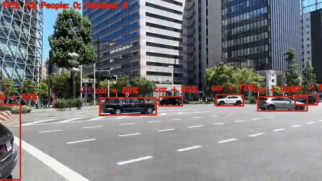

# Python OpenCV Object Detection from Video Using YOLOv3 with CUDA Support
> ### README.md not done!
>
> Check for what is missing from [TODO](#todo)

Python OpenCV object detection using YOLOv3 with CUDA Support.



## Description

This project consists of two parts: Image processing and object recognition. For image proccessing, OpenCV is used and assisted with CUDA. For object recognition; YOLOv3 and OpenCV are used, and assisted with CUDA.

### OpenCV

[OpenCV (Open Source Computer Vision Library)](https://opencv.org/about) is an open source computer vision and machine learning software library. In this project, OpenCV is used to process every frame in given videos and demonstrate the detected objects. Also, with the help of OpenCV's dnn module, objects from the frames are recognized using YOLOv3. 

Normally, OpenCV uses CPU to proccess images as done in [this Python file](object-detection.py). However, this method might cause some devices to struggle. Therefore this project aimed to assist the whole proccess with CUDA support as done in [this Python file](object-detection-cuda.py).

### CUDA

[CUDA](https://blogs.nvidia.com/blog/2012/09/10/what-is-cuda-2) is a parallel computing platform and programming model created by NVIDIA. CUDA helps developers speed up their applications by harnessing the power of GPU accelerators. In this project, CUDA is used to enhance OpenCV. Building OpenCV with CUDA support 

### YOLOv3

[YOLO (You Only Look Once)](https://pjreddie.com/darknet/yolo) is a real-time object detection system. Using a single neural network for each frame and then dividing the image into regions to predict bounding boxes and probabilities. For more detail over [how YOLOv3 works](https://pjreddie.com/darknet/yolo/#:~:text=weights-,How%20It%20Works,-Prior%20detection%20systems).

Uses the [config file](config.cfg) and [weights](yolov3.weights) to detect objects and identify them; classes that are listen on [class file](classes.txt) 

## Getting Started

### Dependencies

#### Software Dependencies

Without CUDA support, only the following are required:
| SOFTWARE | GUIDE (IF NEEDED) |
| --- | --- |
| [Python 3.11.3](https://www.python.org/downloads/release/python-3113) | - |
| [OpenCV 4.8.0](https://opencv.org/releases/) | [Installation Guide - Without CUDA Support](https://pypi.org/project/opencv-python) |
| [Visual Studio Code](https://code.visualstudio.com) | - |

For CUDA support, the following are required:
| SOFTWARE | GUIDE (IF NEEDED) |
| --- | --- |
| [Python 3.11.3](https://www.python.org/downloads/release/python-3113) | - |
| [OpenCV 4.8.0](https://opencv.org/releases) and [OpenCV Contrib 4.8.0](https://github.com/opencv/opencv_contrib/releases/tag/4.8.0) | [Installation Guide - With CUDA Support](#guide) |
| [Java JDK 20](https://www.oracle.com/java/technologies/downloads/) | - |
| [Visual Studio Code](https://code.visualstudio.com) | - |
| [Visual Studio 2022](https://visualstudio.microsoft.com/tr/vs) | - |
| [CMake](https://cmake.org/download) | - |
| [CUDA Toolkit 12.2.0](https://developer.nvidia.com/cuda-downloads) | [Installation Guide](https://developer.nvidia.com/cuda-downloads) |
| [cuDNN 8.9.3, for CUDA 12.x](https://developer.nvidia.com/rdp/cudnn-download) | Installation Guide - OS Dependent: [Linux](https://docs.nvidia.com/deeplearning/cudnn/install-guide/index.html#install-linux), [Windows](https://docs.nvidia.com/deeplearning/cudnn/install-guide/index.html#install-windows) |
| [Zlib](http://www.winimage.com/zLibDll/zlib123dllx64.zip) | [Installation Guide - OS Dependent](#could-not-load-library-zlibwapidll-error) |
| YOLOv3 Config and Weights* | [Installation Guide](https://pjreddie.com/darknet/yolo/#:~:text=Detection%20Using%20A%20Pre%2DTrained%20Model) |
| Classes File* | [Installation Guide](https://github.com/arunponnusamy/object-detection-opencv/blob/master/yolov3.txt) |

> *Downloading [config.cfg](config.cfg) and [classes.txt](classes.txt) from this repo is recommended since the files might have been updated and might cause errors.
> However, *yolov3.weights* is too large to be provided in this repository. Downloading the file from [here](https://pjreddie.com/darknet/yolo/#:~:text=Detection%20Using%20A%20Pre%2DTrained%20Model) is recommended.

#### File Structure

Base file structure of the repo looks like the following:
```bash
├── .gitignore
├── example_image.jpg
├── detection-video-cuda.py
├── detection-video.py
├── settings
│   ├── classes.txt
│   ├── config.cfg
│   └── yolov3.weights
└── videos
    └── *.mp4 (any .mp4 file to used)
```

> Since *yolov3.weights* is too large, the file cannot be provided in the repository. Downloading the file from [here](https://pjreddie.com/darknet/yolo/#:~:text=Detection%20Using%20A%20Pre%2DTrained%20Model) is recommended.

### Executing program

Any Python interpreter should work. In this case, [Visual Studio Code](https://code.visualstudio.com) is used for this project.

## Building OpenCV with CUDA Support (July 2023) - TO BE ADDED

### Guide

## Help

### Building with CMake Gui

### Visual Studio

### OpenCV DLL Issue

### "Could not load library zlibwapi.dll." Error

<!-- https://docs.nvidia.com/deeplearning/cudnn/install-guide/index.html -->

## Acknowledgments

* Object detection inspired by [Arun Ponnusamy](https://github.com/arunponnusamy)'s [object-detection-opencv](https://github.com/arunponnusamy/object-detection-opencv).
* YOLOv3 by [Joseph Chet Redmon](https://pjreddie.com).
* [OpenCV Github page](https://github.com/opencv/opencv) and [OpenCV Contrib Github page](https://github.com/opencv/opencv_contrib).

## TODO

- [x] Create Repo.
- [x] Without CUDA Support
- [ ] For CUDA Support + [Build Guide](#building-opencv-with-cuda-support-july-2023---to-be-added)
- [ ] Last Check